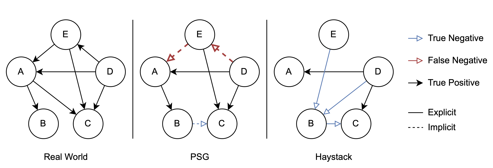

# Haystack: A Panoptic Scene Graph Dataset to Evaluate Rare Predicate Classes

Published at the [Scene Graphs and Graph Representation Learning Workshop @ ICCV 2023](https://sg2rl.github.io/).

Haystack is a panoptic scene graph dataset that in contrast to existing scene graph datasets, includes explicit negative relation annotations. Negative relation annotations are important during evaluation, because they can drastically reduce label noise that occurs when relations are missed by annotators. During sampling, prior scene graph datasets will introduce some false negative labels, wheras Haystack guarantees that all negative relations are correct (assuming a perfect annotator).

Using Haystack, we are able to design three new metrics that give much more fine-grained insights than Recall@k metrics can give.

For more details, take a look at [our project page](https://lorjul.github.io/haystack/) or take a look at [the paper](https://arxiv.org/abs/2309.02286).



## Why create new metrics for scene graph generation?

Recall@k and its variants are very broad metrics that do not give you any in-depth insights about your model. For instance, if you want to know how good your model can "understand" individual predicates, Recall@k cannot give you an exact answer.

### P-AUC (Predicate ROC-AUC)

Estimates "how good the model understands individual predicates".
Usually, rare predicate classes are predicted with lower confidence scores than common predicate classes. For Recall@k this is crucial, P-AUC doesn't care. Recall@k ranks relations over the whole image, P-AUC looks at individual predicate confidence scores.

### PDD (Predicate Discrimination Disadvantage)

Estimates "how often this predicate class gets pushed from the top by other predicate classes, leading to a worse (Mean)Recall@k score".

PDD is high if the predicate was expected to be a top scoring predicate but it could not come out on top.

### PDO (Predicate Dominance Overestimation)

Estimates "how strong this predicate class incorrectly pushes other predicate classes from the top, leading to a worse (Mean)Recall@k score".

PDO is high if the predicate is often among the top scoring predicates for a relation although it should not be there.

Feel free to look at the `calc_metrics.py` script to get a better understanding of the metrics or consult our paper.

## FAQ

### But why do we need a separate dataset?

Good question! Technically, you could use existing scene graph datasets and calculate our proposed metrics. However, our metrics rely on negative annotations (you can only calculate ROC-AUC with positive and negative labels). Existing scene graph datasets only have positive relation annotations and therefore you would have to fall back to interpret missing relations as negative ones. This approach is prone to errors, as highlighted in our paper.

### There are almost no relations on an image!

That is correct, but not a problem at all because of the magic of negative annotations. In fact, a relation can have three different states: positively labelled, negatively labelled, not labelled. If a relation is not labelled, we can simply ignore the model output and only focus on the labelled relations.

### I want to evaluate for SGDet, but your script only supports PredCls!

In this case, you will have to match your outputs first to the ground truth and convert the SGDet problem to PredCls. Then, you can continue with our proposed tools.

### Can I use this dataset for training?

Technically yes, but we would not recommend it (yet), because it was designed for evaluation and probably contains too few samples.

## Evaluate Haystack

We provide a script called `calc_metrics.py` that can calculate P-AUC, PDD, and PDO:

``` bash
python calc_metrics.py annotation_v1.json model_outputs.npy
# use --help for more information
```

It requres a special .npy file that contains the model outputs. This file is framework independent and straightforward to generate.

Download the dataset from http://myweb.rz.uni-augsburg.de/~lorenjul/haystack/v1/.

## Haystack File Format

The input file format for the `calc_metrics.py` script is a numpy NPY file and contains just a single 2D-array.
Each row represents a single relation. The columns are as follows:

1. Image id (same as in the JSON annotation file; `image_id`)
2. Subject index
3. Object index
4. Confidence scores for the individual predicates. **IMPORTANT**: Remove the no-relation score!

## Generate Haystack Output Using OpenPSG

If you are using a code base based on [OpenPSG](https://github.com/Jingkang50/OpenPSG), you can use the files in `patch_openpsg` to generate an output file that can be used to evaluate on Haytack.

1. Put the `haystack_output.py` file inside the `tools` folder.
2. Apply the changes in `test.py.patch` to the `tools/test.py` file.

Create a Haystack-compatible output using:

``` bash
PYTHONPATH='.':$PYTHONPATH \
python tools/test.py \
  configs/imp/panoptic_fpn_r50_fpn_1x_sgdet_psg.py \
  path/to/checkpoint.pth \
  --haystack /path/to/haystack-output.npy
```

Note that you are not forced to use OpenPSG to evaluate on Haystack. The .npy file format should be simple enough to create it from any scene graph model output you have. Feel free to file an issue if you need some help.

## Citation

If you find this work useful, please consider citing our paper:

``` bibtex
@misc{lorenz2023haystack,
      title={Haystack: A Panoptic Scene Graph Dataset to Evaluate Rare Predicate Classes}, 
      author={Julian Lorenz and Florian Barthel and Daniel Kienzle and Rainer Lienhart},
      year={2023},
      eprint={2309.02286},
      archivePrefix={arXiv},
      primaryClass={cs.CV}
}
```
